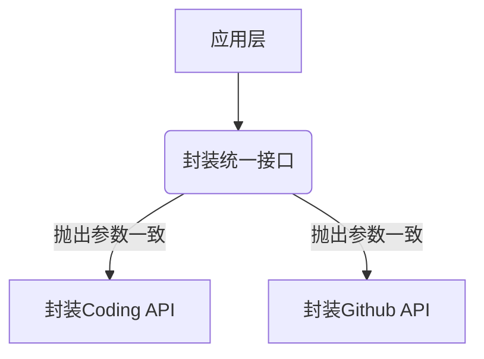

## 为什么需要一个聚合的客户端

举个栗子，之前微博类产品风靡的时候，有很多类似的产品，如：腾讯微博、新浪微博、饭否、Twitter……那么，就可能会发生这样的一个现象，手机上装了一大堆类似的APP，然后用个文件夹放到一起。

实际上大多数也确实这么做了。切换不同的APP，去刷内容不同但本质相近的微博消息。

同样，目前我在我的手机上各自装了 Coding.net 和 GitHub（GitPoint）客户端。

而最近，我在入手iPad Pro之后，发现 Cdoing 并没有对应的 iPad 客户端，从而萌生了这样的一个点子。

<!-- more -->

## 第一步，分析

从技术实现的角度来讲，并不复杂。

因为它们都是代码管理平台，功能相近，有着许多共同之处，随便列举一些：

- 都是通过 OAuth 进行鉴权
- 大多数都功能重叠，如：用户，项目，组织（团队），关注，ISSUE……

## 第二步，设计接口逻辑架构




### 以 Star 一个项目为例

根据操作的类型进行判断，接口参数里带入类型即可。


```sequence
Action->Interface: 关注github\nwillin/leader.js.cool
Interface->Github: 调用关注
Note right of Github: 抛出接口一致
Interface-->Action: 返回结果

Action->Interface: 关注coding\nwillin/leader.js.cool
Interface->Coding: 调用关注
Interface-->Action: 返回结果
```


### 第三步，筹备

TODO List：

- [ ] 整理完整的功能清单（包括相同功能和两个平台差异性功能）
- [ ] 设计UI原型（两者的客户端可以选择一个作为主体风格，或者重新设计）
- [ ] 封装底层接口
- [ ] 开发上层应用
- [ ] 进行测试发布

---

P.S.

由于工作的原因，我个人可能并没有太多的精力去参与所有【创意 iDeas】分类下的项目。如果你对这个项目有兴趣，可以微博或Github上与我联系，或者直接略过我自行去完成该APP的开发。
